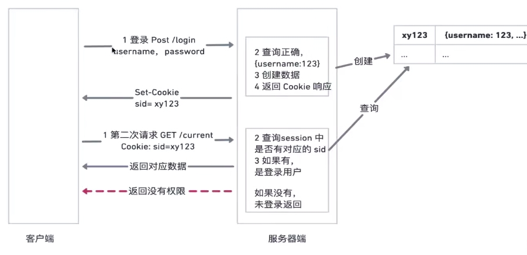

### Cookie
- Cookie 为了解决 HTTP 无状态的问题,即记录用户信息
- 创建 Cookie,服务器使用 Set-Cookie 响应头部向用户代理 (一般是浏览器) 发送Cookie信息
```js
HTTP/1.0 200 0K
Content-type: text/html
Set-Cookie: yummy cookie=choco
Set-Cookie:tastycookie=strawberry
```

#### cookie 做登录校验的过程
* 前端输入用户名密码，传给后端
* 后端验证成功，返回信息时 set-cookie
* 接下来所有接口访问，都自动带上cookie (浏览器的默认行为，http 协议的规定)
 
- 现在，对该服务器发起的每一次新请求，浏览器都会将之前保存的Cookie信息通过 Cookie 请求头部再发送给服务器.这是一个自动的过程
- Cookie 的生命周期
- Set-Cookie: id=a3fwa;Expires=wed，21 0ct 2015 07:28:00 GMT;(客户端时间)

#### Cookie 安全性
- Secure:只应通过被 HTTPS协议加密过的请求发送给服务端
- HttpOnly:无法使用Javascript 对他进行访问。可以有效缓解XSS攻击。
```js
 // Set-Cookie: id=a3fwa; Expires=Wed，21 0ct 2015 07:28:00 GMT;Secure; HttpOnly
// document.cookie 无法访问到对应的数据
```

#### 作用域
- Domain: Domain 指定了哪些主机可以接受 Cookie，如果不指定，默认为origin，不包含子域名
```js
// Set-Cookie: id=a3fWa;
// 假如不设置，假如我们的网址目前是 test.com，只有完全同源才能访问。那么只有 test.com 可以访问，api.test.com 不可访问
```
- Path:Path 标识指定了主机下的哪些路径可以接受 Cookie
```js
 //  如果设置， Set-Cookie: id=a3fWa; Domain=test.com; Path=/
 // 子域名也包含其中，比如test.com, api.test.com， xxx.test.com
```

#### SameSite新的属性
SameSite Cookie 允许服务器要求某个 cookie 在跨站请求时不会被发送，可以阻止跨站请求伪造攻击 (Cross-Site Request Forgery，简称 CSRF) ，SameSite cookies 是相对较新的一个字段，所有主流浏览器都已经得到支持   
```js
Set-Cookie: CookieName=CookieValue;SameSite=Strict;
```
- Strict最为严格，完全禁止第三方 Cookie，跨站点时，任何情况下都不会发送Cookie。换言之，只有当前网页的 URL 与请求目标一致，才会带上 Cookie。
- Lax规则稍稍放宽，大多数情况也是不发送第三方 Cookie，但是导航到目标网址的 Get 请求除外。(<a>标签、link标签、form的get 发送cookie)(form的post、iframe、ajax、image 不发送cookie)


### Session
 

#### Session 优点
* 原理简单，易于学习
* 用户信息存储在服务端，可以快速封禁某个登录的用户- 有这方强需求的人，一定选择 Session

#### Session 的缺点
* 占用服务端内存，有硬件成本
* 多进程、多服务器时，不好同步-一般使用第三方 redis 存储，成本高
* 跨域传递cookie，需要特殊配置
