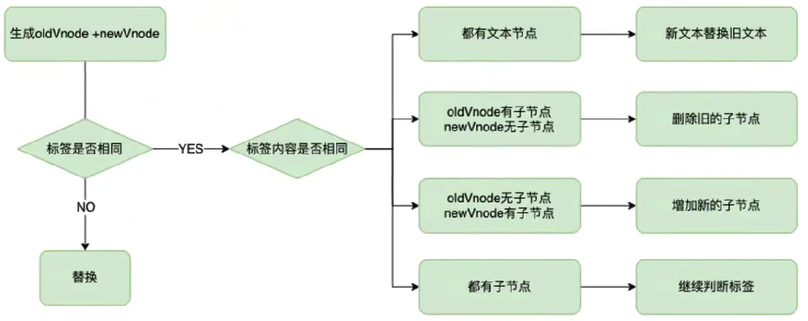
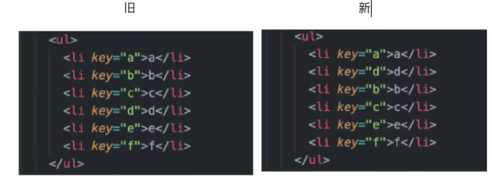
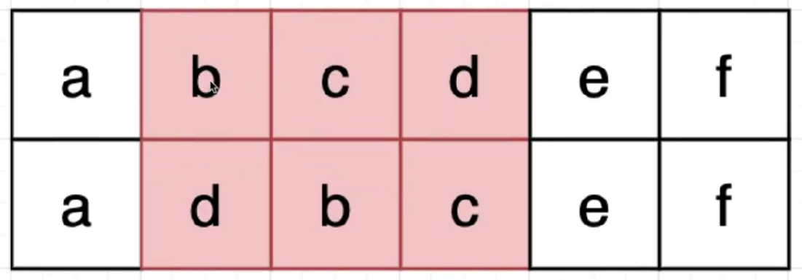
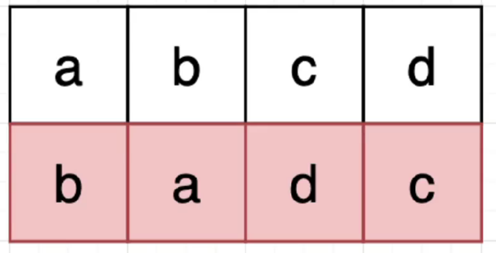

### vue3 与 React

#### Vue

- [官网](https://cn.vuejs.org/guide/quick-start.html)
- 特点
  - 引入了更灵活和可复用的组合式 API，基于函数式的开发模式使得代码更易于测试和理解
  - 通过使用虚拟 DOM 和静态树提升渲染速度，并通过编译优化减少运行时的开销。

#### React

- [官网](https://zh-hans.react.dev/learn)
- 特点

  - React 一直以来就是以组件为核心的开发模式，它采用的单向数据流和虚拟 DOM 技术，使得应用的状态管理更加清晰，渲染效率也更高。
  - 16.8 版本之后引入了函数组件，降低了开发者的学习难度，并且 React18 版本默认是函数组件开发

#### 组件风格

- React18 函数组件开发，Vue3 也组件像函数式组件开发靠拢，使用组合式 API 和函数式很相似

#### 状态管理

- Vue 建议使用 Pinia，Pinia 和组合式开发方式更加统一
- React 建议使用 Redux-toolkit 或者 Mobx。

#### Diff 算法

- 两个框架采用的都是同级对比策略
- 新旧节点对比
  
- Vue3 策略:找出最长递增子序列，首尾对比直到不同停止
  - 去除首尾相同元素，保留不同
    
    
  - 即旧[b,c, d]、新[d,b,c]，新数组元素在旧数组中对应的下标数组为[3,1,2]
  - 需要保证旧元素移动元素次数最少得到新数组，可见保持[1,2]不变，移动元素 3 到最前面即可，只移动一次元素
  - 那么[1,2]就是所谓的最长递增子序列
- React 策略:节点的索引对比，从左往右移动
  - 第一行旧节点的索引为 mountlndex，第二行新节点的索引为 lastIndex
  - 当 mountlndex 大于或者等于 lastlndex 时，两个节点不移动
  - 把 mountlndex 赋值给 lastIndex,lastIndex=mountIndex
  - 当 mountlndex 小于 lastIndex 时，从左往右移动旧节点
    

### [创建一个 Vue 应用](https://cn.vuejs.org/guide/quick-start.html)

```shell
npm create vue@latest
```

### 响应式 Props 解构

```html
<!-- 父组件 -->
<Child :count="0" :user="{name:'Vue'}" />

<!-- 子组件 -->
<script setup>
  const { count = 0, user } = defineProps({
    count: Number,
    user: Object,
  });
  // 自动编译为 props.count / props.user
</script>
```

### 核心 API 增强

- useId() 生成 SSR/CSR 稳定唯一 ID 无障碍表单元素绑定
- useTemplateRef() 动态 DOM 引用管理 动态组件/条件渲染场景
- defineModel() 双向绑定革命性简化 表单组件开发

### SSR 重大升级

```ts
// 惰性激活策略
defineAsyncComponent({
  loader: () => import("./Comp.vue"),
  hydrate: hydrateOnVisible(), // 可视时激活
});
/**
 * ​支持模式​：

hydrateOnIdle：空闲时激活
hydrateOnVisible：进入视窗激活
自定义激活策略

 */

// <!-- 允许客户端与服务端渲染差异 -->
// <span data-allow-mismatch="text">
//   {{ dynamicContent }}
// </span>
// 支持属性级差异白名单配置
```

### Vue3 Attribute 绑定

- v-html
- v-bind:属性名 简写 :属性名

```js
// 动态绑定多个值
const objectOfAttrs = {
  id: "container",
  class: "wrapper",
  style: "background-color:green",
};

<div v-bind="objectOfAttrs"></div>;

// 动态参数
/**
注意，参数表达式有一些约束，
参见下面“动态参数值的限制”与“动态参数语法的限制”章节的解释
*/
<a v-bind:[attributeName]="url"> ... </a>

// 简写
<a :[attributeName]="url"> ... </a>

// 事件
<a v-on:[eventName]="doSomething"> ... </a>

// 简写
<a @[eventName]="doSomething"> ... </a>
```

### v-cloak 用于隐藏尚未完成编译的 DOM 模板。

```css
[v-cloak] {
  display: none;
}
```

```html
<div v-cloak>{{ message }}</div>
```

`直到编译完成前，<div> 将不可见。`

### vue3 响应式

#### ref

组件的 ref 是 获取组件对象
使用 <script setup> 的组件是默认关闭的——即通过模板引用或者 $parent 链获取到的组件的公开实例，不会暴露任何在 <script setup> 中声明的绑定。

可以通过 defineExpose 编译器宏来显式指定在 <script setup> 组件中要暴露出去的属性：

```html
<script setup>
  import { ref } from "vue";

  const a = 1;
  const b = ref(2);

  defineExpose({
    a,
    b,
  });
</script>
```

#### DOM 更新时机

- 当你修改了响应式状态时，DOM 会被自动更新，但是更新并不是同步的，Vue 会在"nexttick"更新周期中缓冲所有状态的修改，以确保不管你进行了多少次状态修改，每个组件都只会被更新一次
- 要等待 DOM 更新完成后再执行额外的代码，可以使用 nextTick()全局 API

```ts
import { nextTick )from'vue
async function increment(){
count.yalue++
await nextTick()
//现在 DOM 已经更新了
}
```

#### reactive

- 局限性
  - 有限的值类型: 它只能用于对象类型(对象、数组和如 map、set 这样的集合类型)。它不能持有如 string、number 或 boolean 这样的原始类型
  - 不能替换整个对象
  ```ts
  let state = reactive({ count: 0 });
  //上面的({count:0})引用将不再被追踪
  //(响应性连接已丢失!)
  state = reactive({ count: 1 });
  ```
  - 对解构操作不友好

### 计算属性 computed

```html
<!-- 可写计算属性 -->
<script setup>
  import { ref,computed }from"vue";

  const firstName =ref("老");
  const lastName =ref("王");

  fullName= computed({
    // getter
    get(){
     return firstName.value + " " + lastName.value;
    }
    // setter
    set(newvalue){
      // 注意:我们这里使用的是解构赋值语法
      [firstName.value,lastName.value]= newValue.split("");
    }
  });
  // fullName.value="李 晓明";
</script>
<template> <span>{{ fullName }}</span></template>
```

### [Class 与 Style 绑定](https://cn.vuejs.org/guide/essentials/class-and-style.html#class-and-style-bindings)

```html
<div :class="[isActive ? activeClass : '', errorClass]"></div>
<!-- 简写 -->
<div :class="[{ [activeClass]: isActive }, errorClass]"></div>
```

### v-if vs. v-show

- v-if 是“真实的”按条件渲染，因为它确保了在切换时，条件区块内的事件监听器和子组件都会被销毁与重建。

- v-if 也是惰性的：如果在初次渲染时条件值为 false，则不会做任何事。条件区块只有当条件首次变为 true 时才被渲染。

- 相比之下，v-show 简单许多，元素无论初始条件如何，始终会被渲染，只有 CSS display 属性会被切换。

- 总的来说，v-if 有更高的切换开销，而 v-show 有更高的初始渲染开销。因此，如果需要频繁切换，则使用 v-show 较好；如果在运行时绑定条件很少改变，则 v-if 会更合适。

### v-if 和 v-for​

当 v-if 和 v-for 同时存在于一个元素上的时候，v-if 会首先被执行。请查看列表渲染指南获取更多细节。

### 事件修饰符

- stop 停止传递
- prevent 不再重新加载页面
- self 事件处理器不来自子元素
- capture capture` 捕获模式
- once 最多被触发一次
- passive 滚动事件的默认行为 (scrolling) 将立即发生而非等待

```html
<!-- 单击事件将停止传递 -->
<a @click.stop="doThis"></a>

<!-- 提交事件将不再重新加载页面 -->
<form @submit.prevent="onSubmit"></form>

<!-- 修饰语可以使用链式书写 -->
<a @click.stop.prevent="doThat"></a>

<!-- 也可以只有修饰符 -->
<form @submit.prevent></form>

<!-- 仅当 event.target 是元素本身时才会触发事件处理器 -->
<!-- 例如：事件处理器不来自子元素 -->
<div @click.self="doThat">...</div>

<!-- 添加事件监听器时，使用 `capture` 捕获模式 -->
<!-- 例如：指向内部元素的事件，在被内部元素处理前，先被外部处理 -->
<div @click.capture="doThis">...</div>

<!-- 点击事件最多被触发一次 -->
<a @click.once="doThis"></a>

<!-- 滚动事件的默认行为 (scrolling) 将立即发生而非等待 `onScroll` 完成 -->
<!-- 以防其中包含 `event.preventDefault()` -->
<div @scroll.passive="onScroll">...</div>
```

### 按键修饰符

- enter
- tab
- delete (捕获“Delete”和“Backspace”两个按键)
- esc
- space
- up
- down
- left
- right
- ctrl
- alt
- shift
- meta

### watch

- immediate：在侦听器创建时立即触发回调。第一次调用时，旧值将为 undefined。
- deep：如果源是对象或数组，则强制深度遍历源，以便在深度变更时触发回调。 在 Vue 3.5+ 中，deep 选项还可以是一个数字，表示最大遍历深度——即 Vue 应该遍历对象嵌套属性的级数。`谨慎使用`
- flush：调整回调的刷新时机。如果想在侦听器回调中能访问被 Vue 更新之后的所属组件的 DOM，你需要指明 flush: 'post'; 创建一个同步触发的侦听器，它会在 Vue 进行任何更新之前触发：flush: 'sync'
- onTrack / onTrigger：调试侦听器的依赖关系。侦听器的 onTrack 和 onTrigger 选项仅会在开发模式下工作。
- once: true 一次性侦听器
- 副作用清理

```ts
/**
 * 请注意，onWatcherCleanup 仅在 Vue 3.5+ 中支持，并且必须在 watchEffect 效果函数或 watch 回调函数的同步执行期间调用：你不能在异步函数的 await 语句之后调用它。

作为替代，onCleanup 函数还作为第三个参数传递给侦听器回调，以及 watchEffect 作用函数的第一个参数：
 */
import { watch, onWatcherCleanup } from "vue";

watch(id, (newId) => {
  const controller = new AbortController();

  fetch(`/api/${newId}`, { signal: controller.signal }).then(() => {
    // 回调逻辑
  });

  onWatcherCleanup(() => {
    // 终止过期请求
    controller.abort();
  });
});

/**
 * 这在 3.5 之前的版本有效。此外，通过函数参数传递的 onCleanup 与侦听器实例相绑定，因此不受 onWatcherCleanup 的同步限制。
 */
watch(id, (newId, oldId, onCleanup) => {
  // ...
  onCleanup(() => {
    // 清理逻辑
  });
});

watchEffect((onCleanup) => {
  // ...
  onCleanup(() => {
    // 清理逻辑
  });
});
```

- 停止侦听器

```ts
const unwatch = watchEffect(() => {});

// ...当该侦听器不再需要时
unwatch();

// 需要异步请求得到的数据
const data = ref(null);

watchEffect(() => {
  if (data.value) {
    // 数据加载后执行某些操作...
  }
});
```

### watch vs. watchEffect​

- watch 和 watchEffect 都能响应式地执行有副作用的回调。它们之间的主要区别是追踪响应式依赖的方式：

- watch 只追踪明确侦听的数据源。它不会追踪任何在回调中访问到的东西。另外，仅在数据源确实改变时才会触发回调。watch 会避免在发生副作用时追踪依赖，因此，我们能更加精确地控制回调函数的触发时机。

- watchEffect，则会在副作用发生期间追踪依赖。它会在同步执行过程中，自动追踪所有能访问到的响应式属性。这更方便，而且代码往往更简洁，但有时其响应性依赖关系会不那么明确。

### 生命周期

- onMounted()
- onUpdated()
- onUnmounted()
- onBeforeMount()
- onBeforeUpdate()
- onBeforeUnmount()
- onErrorCaptured()
- onRenderTracked()
- onRenderTriggered()
- onActivated()
- onDeactivated()
- onServerPrefetch()

### 父子组件交互

1. 父传子通信（Props）
2. 子传父通信（Emit）
3. 子组件暴露方法（defineExpose）
4. 事件总线（mitt）

```ts
// eventBus.js
import mitt from "mitt";
export default mitt();

// 组件A发送
eventBus.emit("custom-event", data);

// 组件B接收
eventBus.on("custom-event", handleData);
```

5. Provide/Inject
6. Pinia 状态管理

### 插槽

```html
<!-- 条件渲染优化 -->
<template v-if="$slots.header">
  <slot name="header"></slot>
</template>
<!-- 动态插槽名 -->
<template>
  <Component>
    <template #[dynamicSlotName]> 动态内容（根据变量值匹配插槽） </template>
  </Component>
</template>

<script setup>
  const dynamicSlotName = ref("header");
</script>
```

```ts
// 子组件
<script setup lang="ts">
import { defineSlots } from 'vue'

defineSlots<{
  default(props: { msg: string }): any
  header?: (props: { title: string }) => any
}>()
</script>

// 父组件
<script setup>
const slots = useSlots()
watchEffect(() => {
  if (slots.header) {
    console.log('检测到 header 插槽被使用')
  }
})
</script>
```

```html
<!-- Vue3 动态插槽名传值实现方案 -->
<template>
  <div>
    <!-- 动态插槽名绑定父组件数据 -->
    <slot
      name="header"
      :childData="childData"
      :parentMessage="parentMessage"
    ></slot>
  </div>
</template>

<script setup>
  import { ref } from "vue";

  const childData = ref("来自子组件的数据");
  const props = defineProps(["parentMessage"]); // 接收父组件数据
</script>

<template>
  <DynamicSlotChild
    :parentMessage="parentMsg"
    v-slot:[dynamicSlotName]="{ childData, parentMessage }"
  >
    <div class="content-box">
      <h3>动态插槽内容：</h3>
      <p>子组件数据 → {{ childData }}</p>
      <p>父组件数据 → {{ parentMessage }}</p>
      <p>混合数据 → {{ parentMsg + ' - ' + childData }}</p>
    </div>
  </DynamicSlotChild>
</template>

<script setup>
  import { ref } from "vue";
  const parentMsg = ref("父组件原始数据");
  const dynamicSlotName = ref("header"); // 控制动态插槽名
</script>
```

### defineModel

核心优势 ​：

1. 双向绑定代码量减少 90%
2. 自动处理 modelValue Props 和 update:modelValue 事件
3. 原生支持 TypeScript 类型推断
4. 内置修饰符处理能力
5. 多模型绑定支持

```html
<!-- 单个 -->
<!-- 父组件 -->
<CustomInput v-model="inputValue" />

<!-- 子组件 -->
<script setup>
  const model = defineModel(); // 自动生成 modelValue prop
</script>

<template>
  <input v-model="model" />
</template>

<!-- 多个 -->
<!-- 父组件 -->
<UserForm v-model:name="userName" v-model:age="userAge" />

<!-- 子组件 -->
<script setup>
  const nameModel = defineModel("name");
  const ageModel = defineModel("age", {
    type: Number,
    default: 18,
  });
</script>

<!-- 修饰符处理 -->
<!-- 父组件 -->
<SmartInput v-model.trim.uppercase="text" />

<!-- 子组件 -->
<script setup>
  const [model, modifiers] = defineModel({
    set(value) {
      let processed = value;
      if (modifiers.uppercase) processed = value.toUpperCase();
      if (modifiers.trim) processed = processed.trim();
      return processed;
    },
  });
</script>
```

`性能优化`

```ts
// 避免深层嵌套
const model = defineModel({
  set(value) {
    // 添加防抖逻辑
    return debounce(value, 300);
  },
});

// 大数据量场景
const heavyModel = defineModel({
  get(val) {
    return Object.freeze(val); // 冻结数据防止意外修改
  },
});
```

### Provide/Inject

### KeepAlive

保存页面。v-if 会重置页面的。使用<KeepAlive></KeepAlive>包裹就不会重置。
相当于 v-show 的效果
