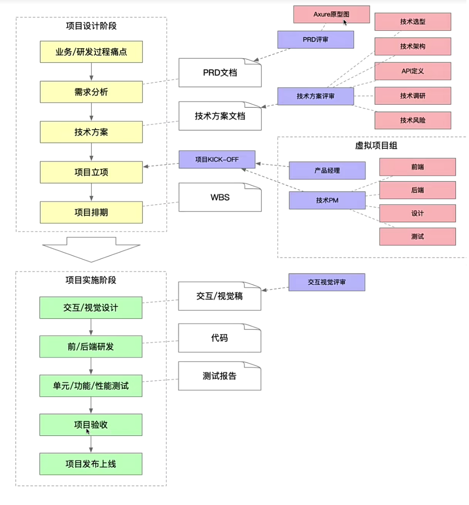

## 技术架构设计

一个原则就是要看整体，不要特别关注细节

### 软件开发生命周期（SDLC）

计划、需求分析、软件设计、软件实现、测试集成、维护

| 阶段       | 内容                                                                                                                            |
| ---------- | ------------------------------------------------------------------------------------------------------------------------------- |
| 需求       | 需求调研 & 技术架构讨论                                                                                                         |
| 开发       | 业务系统详细设计 -> 业务系统开发 -> 单元测试 -> 增加 CI 构建文件和镜像构建文件 DockerFile -> 提交代代码到 GitLab                |
| 测试       | 触发 CI 构建镜像，CD 自动发布应用到测试环境 -> 测试环境应用测试 -> 代码迭代、问题修复后再测试（重复迭代） -> 通过测试，转预生产 |
| 预生产测试 | 预生产测试 -> 迭代回归测试 -> 生产上线                                                                                          |
| 生产上线   | 流程申请 -> 配置修改以及确认 -> 上线准备（应用、设备、网络、人员等） -> 上线                                                    |

### 需要几个项目

- 前后端分离
- 前端（SPA 项目，使用 Vue 或者 React）
- 后端 NodeJS
  - RESTful API
  - H5 页面 SSR（server side rendering）
- 前端组件库

### 项目与项目之间的关系

前端：  
组件库 -> 前端 SPA 项目
组件库 -> H5 页面 SSR

后端： 服务端渲染 H5 页面 服务端提供 RESTful API

### 核心问题分析

例如：

1. 难点问题分析
2. 考虑扩展性

### 前端研发流程的进化内核

- 效率
- 质量
- 性能

### 前端流程

| 流程     | 内容                                                |                                                                                      |                                                         |
| -------- | --------------------------------------------------- | ------------------------------------------------------------------------------------ | ------------------------------------------------------- |
| 创建项目 | 脚手架创建 或者 研发平台创建                        | 项目模板 - 移动端 小程序 PC 端 微前端 （工程脚手架，合并了 vue 和 react 的项目创建） | -                                                       |
| 项目开发 | 技术规范                                            | Git 规范 编码规范 文档规范                                                           | -                                                       |
| 项目开发 | 研发模式                                            | 源码开发（vscode、WebStorm） 低代码（钉钉宜搭、MS PowerApps） 项目搭建               | 物料市场 - https://fusion.design （业务组件 区块 模版） |
| 项目开发 | 前端监控                                            | 前端埋点 前端日志 流量大数据分析+数据可视化                                          | -                                                       |
| 项目测试 | 单元测试 性能测试                                   | -                                                                                    | -                                                       |
| 项目发布 | GitFlow 自动化 远程自助检查 发布机（云端构建+发布） | -                                                                                    | -                                                       |

#### 创建项目

项目代码 ->抽象 -> 项目模板（存放数据库） ->创建（脚手架读取生成） -> 新项目

#### 研发模式

- 复用代码 -> 组件、代码片段、模版代码
- 赋能产品、运营或后端非前端开发 -> 低代码搭建

项目代码 ->抽象 组件 -> 存储到数据库 -> 脚手架读取 -> 组件应用到新项目中

#### 前端监控

- 初阶：使用第三方平台 百度 有盟 阿里云 ARMS 等
- 中阶：自研前端监控库，缺乏完整的监控体系
- 高阶：自研前端监控平台，具备完整的监控体系

监控作用

- 流量数据监控，pv、uv、点击率、页面停留时长等
- 自定义事件监控-曝光事件、滑动事件、请求事件等
- 交易指标监控-成交额、转化率

`曝光定义`：dom 元素出现在屏幕窗口中，被用户看到，且停留时间超过 500ms，才算一次曝光。dom 元素退出窗口后重新进入窗口，再停留 500ms，记为第二次曝光。

#### 测试

测试同学：功能测试 - 性能测试 - 测试用例  
前端同学：单元测试（常用于组件库、API 等 Jest、Mocha）
上线项目测试：

- 测试同学回归
- 利用前端监控，进行监控项目稳定性和性能，并上报前端日志
  - 稳定性：预防 jserror、白屏检测等
  - 性能：如秒开率、首屏渲染时长、接口请求时长等
  - 前端日志： 如 console.log、API 请求记录等

#### 发布

发布提醒：利用脚手架统一管理发布价格
优势：

- 规范：统一发布规范如 commit 记录、分支名称、代码规范等
- 效率：避免大量重复操作
- 安全：避免信息泄露
  流程：
- GitFlow 自动化代码提交
- 远程代码自动检查
- 云端完成构建与发布操作

### 项目

痛点 -> 产生需求（PD） -> （PRD 文档 包括产品原型图 目标等量化指标）  
-> 技术方案 （技术选型 技术架构 API 定义 技术的调研 评估技术风险） -> 文档（架构师工作）  
-> 项目立项 （启动 人员分配）  
-> 项目计划/排期（时间点-WBS 文档）  
-> 上面设计阶段  
-> 项目实施阶段 -> 交互/视觉设计（设计稿） -> 开发 （前后端开发 联调）  
-> 测试阶段  
-> 产品业务 验收微调
-> 上线

### Git 操作规范

master(代码仓库) | dev -> dev0.0.1 | release -> release0.0.1  
Git 仓库 ->fork -> owner Git 仓库 ->clone -> 本地仓库（git checkout -b [new branch]; git add . & git commit; git pull origin master; git push origin [your branch] ） ->push -> owner Git 仓库 ->发起 pull request ->code review -> 创建 tags&删除开发分支
