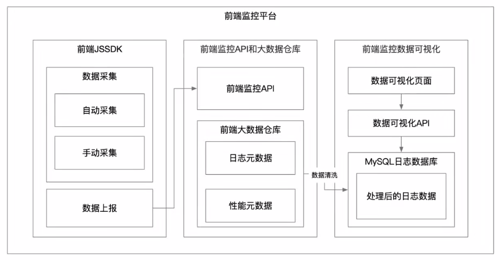

### 前端监控

#### 为什么要前端监控

- 页面的访问行为 - PV、UV、IP、PV 点击率、UV 点击率
- 用户操作行为 - 模块曝光（显示）、模块点击、滑动等操作
- 页面性能，首屏渲染时间，API 请求时间
- 异常的监控，JS Error，API 异常、业务异常
- 业务的监控数据。（前端上报，依靠后端统计）

#### 应用场景

- 流量分析
- 行为分析
- 性能监控
- 异常监控

#### 前端监控平台有哪些

- 百度统计
- 阿里云 ARMS
- 友盟 - APP 监控
  `流量统计和分析免费,行为分析需要付费`

#### 为什么需要自建

- 数据掌握在自己手里做分析。其他平台数据只能看
- 希望更多的分析纬度和能力

#### 前端监控平台架构设计

##### 监控平台分层

- 前端监控 JS-SDK
  - 采集
  - 上报
    - 默认上报：页面 PV、性能
    - 手动上报：页面操作行为
- 前端监控 API 和大数据仓库
  - 接收上报的数据
  - 数据仓库：MaxCompute
    - 数据存储
    - 数据查询
- 前端监控数据的可视化

  - 日志大数据清洗
  - 大数据回流（非结构化数据 => 结构化数据）
  - 对结构化进行运算生成图表



#### 浏览器的 5 种 Observer

- IntersectionObserver 用于观察一个元素是否在视窗可见.构造函数创建并返回一个新的 IntersectionObserver 对象，一般用于无限滚动,图片懒加载,埋点,控制动画/视频执行
- MutationObserver 是异步触发,DOM 的变动并不会马上触发,而是要等到当前所有 DOM`操作都结束才触发，可以通过配置项,监听目标 DOM 下子元素的变更记录。一般用于更高性能的数据绑定及响应
- PerformanceObserver 用于监测性能度量事件,在浏览器的性能时间轴记录下一个新的 performance entries 的时候将会被通知，用途:更细颗粒的性能监控.
- ResizeObserver 构造器创新一个新的 ResizeObserver 对象,用于接收 Element 内容区域的改变或 SVGElement 的边界框改变改变，用途:更智能的响应式布局(取代@media)以及响应式组件
- ReportingObserver 构造函数会创建一个新的 ReportingObserver 对象实,该实例可用于收集和获取 reports，使用:将浏览器弃用的 API 或者运行时浏览器的干预行为由自己约束

#### 流程

1. 前端 JS SDK -> 数据采集 {(自动采集 PV) (手动采集-exp、click、custom)} -> 数据上报{新建 img 标签 -> 设置 img src 属性 -> 调用上报 API}
2. 前端监控 API -> Web API (HTTP){收集上报参数 -> 生成上报 SQL -> 调用 Python 执行 SQL} -> pyodps 脚本{生成 ODPS 对象、传入 accesskey 和 secretkey} -> o.executeSql 执行 SQL 完成数据上报
3. 前端监控大数据仓库 -> MaxCompute{创建大数据日志表 -> 创建大数据清洗表 -> 创建清洗表调度任务}
4. 前端监控数据库 -> 创建可视化数据表
5. 前端监控可视化 -> 页面流量指标{PV UV PV 点击率 UV 点击率 跳失率 停留时长} 模块指标{模块曝光率 模块点击率 模块输入内容 模块滑动} 页面性能指标{首屏渲染时间 API 请求完成时间 完全加载时间} 页面异常指标{jsError API 异常 业务异常}

`上报需要创建上报队列，使用window.requestIdleCallback 浏览器闲时上报`

#### 可视化

#### 流量指标

页面访问行为

- PV 页面流量量 count(type = pv)
- UV 用户浏览量 count(type = pv ，distinct visitor)
  - visitor 不能为 null 区分登录用户&未登录用户
- PV 点击率 count(type=click)/PV
- UV 点击率 count(type=click,distinct visitor)/UV
- 停留时长 用户从打开页面到关闭页面的总时长 leave page time - open time

- 可视化
  - 通过折线图的方式展示 24 小时内每小时页面指标
  - 通过表格的方式 展示一定时段内页面的指标

模块访问行为

- 模块曝光 模块显示时发送的埋点
- 模块点击 模块被点击时发送的埋点
- 可视化
  - 通过表格方式展示所有模块曝光和点击数据

页面性能

- 首屏渲染时间：从打开页面到页面完全加载的时间计算公式： window.onload = () => { new Date().getTime() - performance.timing.navigationStart }
- API 请求时间 收到计算
- 可视化
  - 折线图
  - 表格

页面异常监控

- JS Error
  - 全局 js error
    ```js
    // 捕获全局 js error 但是不能捕获到 promise error；因为promise是微任务，onerror是宏任务。setTimeout setInterview 等同是宏任务的可以
    window.onerror = (errMsg, file, line, col, err) => {};
    ```
  - 全局 promise error
    ```js
    window.onunhandledrejection = (e) => {
      console.log(e.reason.message, e.reason.stack);
    };
    ```
  - 自定义抛出的 js error - try catch 上报 stack 和 msg
- API Error API 响应过程中出现的异常
- 业务一次：自定义上报
- 可视化
  - 折线图
  - 表格

#### 浏览器一个 URL 的加载流程

每个资源文件都会经历这个过程
`https://developer.mozilla.org/zh-CN/docs/Web/API/Performance_API/Navigation_timing`
`Navigation Timing API`
PerformanceTiming 接口得到它们，按照事件发生的先后顺序，这些事件的列表如下

- navigation 浏览器开始处理
  - navigationStart
  - unloadEventStart
  - unloadEventEnd
  - redirectStart 重定向处理
  - redirectEnd
- fetch APP cache 缓存，如果命中缓存直接缓存读取
  - fetchStart
- DNS 如果 DNS 缓存命中 也会跳过
  - domainLookupStart
  - domainLookupEnd
- TCP 连接
  - connectStart
  - connectEnd
  - secureConnectionStart (HTTPS)
- Request 资源请求
  - requestStart
- Response 资源请求完成
  - responseStart
  - responseEnd
- Processing 渲染
  - domLoading
  - domInteractive
  - domContentLoadedEventStart
  - domContentLoadedEventEnd
  - domComplete
- onLoad
  - loadEventStart
  - loadEventEnd

整个流程的时间定义

- navigationStart -> fetchStart 浏览器启动时间
- fetchStart -> domainLookupStart 读取缓存时间
- domainLookupStart -> domainLookupEnd DNS 时间
- connectStart -> connectEnd TCP 时间
- requestStart -> responseStart 请求时间
- responseStart -> responseEnd 响应时间
- domLoading -> domComplete Processing 时间
- loadEventStart -> loadEventEnd onLoad 时间

#### 前端性能指标定义

- fp 首屏渲染 第一个 像素 渲染的时间戳
- fcp 第一个 dom 的第一个内容 渲染的时间戳
- fmp 首屏视口区域的内容被渲染出来的时间戳
- lcp 最大的一个元素被渲染出来的时间

```js
const observer = new PerformanceObserver(callback);
observer.observe({
  entryTypes: ["paint", "largest-contentful-paint"],
});

let fp = 0; // first-paint
let fcp = 0; // first-contentful-paint
let lcp = 0; // largest-contentful-paint
function callback(perf) {
  perf.getEntries().forEach((timing) => {
    console.log(timing);
    if (timing.name === "first-paint") {
      fp = timing.startTime;
    } else if (timing.name === "first-contentful-paint") {
      fcp = timing.startTime;
    } else if (timing.entryType === "largest-contentful-paint") {
      lcp = timing.startTime;
    }
    // if (timing.entryType === 'navigation') {
    //   const dns = timing.domainLookupEnd - timing.domainLookupStart;
    //   const tcp = timing.connectEnd - timing.connectStart;
    //   const http = timing.responseEnd - timing.requestStart;
    //   const dom = timing.domComplete - timing.domInteractive;
    //   const load = timing.loadEventEnd - timing.loadEventStart;
    //   console.log('dns', dns);
    //   console.log('tcp', tcp);
    //   console.log('http', http);
    //   console.log('dom', dom);
    //   console.log('load', load);
    // }
  });
  console.log("fp", fp);
  console.log("fcp", fcp);
  console.log("lcp", lcp);
}
```
